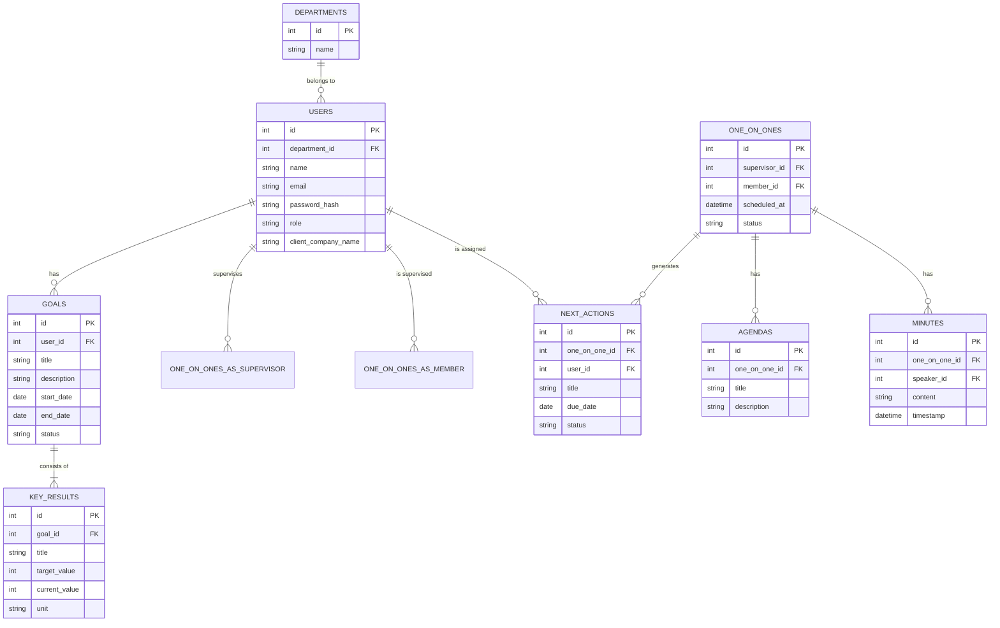

# 基本設計書

## 1. システム構成図

```mermaid
graph TD
    subgraph "ユーザーのブラウザ"
        A[Next.js / React]
    end

    subgraph "Vercel"
        B[Next.js Frontend]
        C[Nest.js API Routes]
    end

    subgraph "外部サービス"
        D[Database (例: PostgreSQL on Supabase)]
        E[Google Calendar API]
        F[Slack API]
        G[Google Authentication]
    end

    A -- HTTPS --> B
    B -- API Call --> C
    C -- CRUD --> D
    C -- Calendar連携 --> E
    C -- 通知 --> F
    A -- Google SSO --> G
    C -- User Auth --> G

    style B fill:#f9f,stroke:#333,stroke-width:2px
    style C fill:#ccf,stroke:#333,stroke-width:2px
```

### 1.1. システム構成の説明

## 2. データベース設計 (ER図)



### 2.1. ER図の説明

*   **USERS (ユーザー):**
    *   `role` カラムで「一般」「リーダー」「マネージャー」などの権限を管理します。
    *   `client_company_name` カラムでSESの特性である常駐先クライアント名を保持します。
    *   上司・部下の関係は `USERS` テーブルの自己参照、もしくは中間テーブルで表現することも考えられますが、まずはシンプルに `ONE_ON_ONES` の `supervisor_id` と `member_id` で関係性を示しています。
*   **DEPARTMENTS (部署):**
    *   ユーザーが所属する部署です。権限管理にも関わってきます。
*   **GOALS (目標) & KEY_RESULTS (測定指標):**
    *   1人のユーザーが複数の目標を持てるように、`USERS` と `GOALS` は一対多の関係です。
    *   1つの目標が複数の測定指標から成り立つため、`GOALS` と `KEY_RESULTS` も一対多の関係です。
*   **ONE_ON_ONES (1on1ミーティング):**
    *   上司 (`supervisor_id`) と部下 (`member_id`) の両方のユーザーIDを保持します。
*   **AGENDAS (アジェンダ), MINUTES (議事録), NEXT_ACTIONS (ネクストアクション):**
    *   それぞれが特定の `ONE_ON_ONES` に紐づく形で、一対多の関係になります。
    *   `NEXT_ACTIONS` は担当者 (`user_id`) も保持します。


*   **フロントエンド (Next.js/React):** ユーザーが直接操作するUI部分です。Vercel上でホスティングされます。
*   **バックエンド (Nest.js API Routes):** Next.jsのAPI Routes機能を利用し、サーバーレス関数としてバックエンドロジックをVercel上で実行します。これにより、インフラ管理の負担を軽減しつつ、フロントエンドとバックエンドを一体的に開発・デプロイできます。
*   **データベース:** Vercelと連携しやすいSupabase上のPostgreSQLなどを想定しています。ユーザー情報、目標、1on1の記録などを永続化します。
*   **外部サービス連携:**
    *   **Google Calendar API:** 1on1のスケジュール連携に使用します。
    *   **Slack API:** Next Actionの通知などに使用します。
    *   **Google Authentication:** GoogleアカウントでのSSO（シングルサインオン）を実現します。
